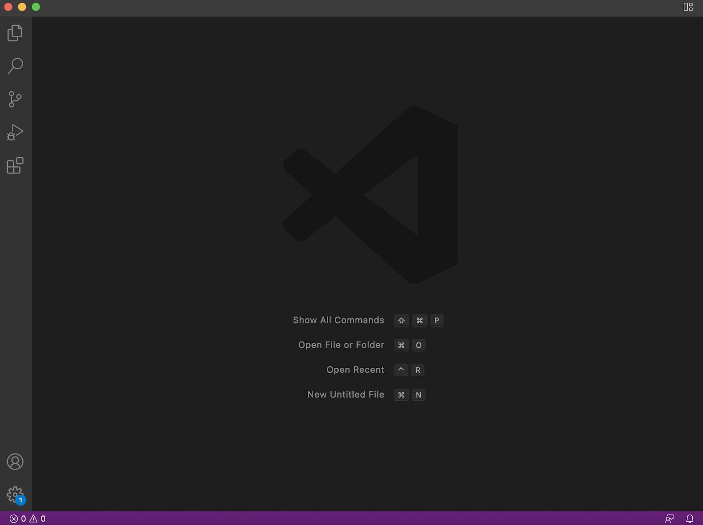
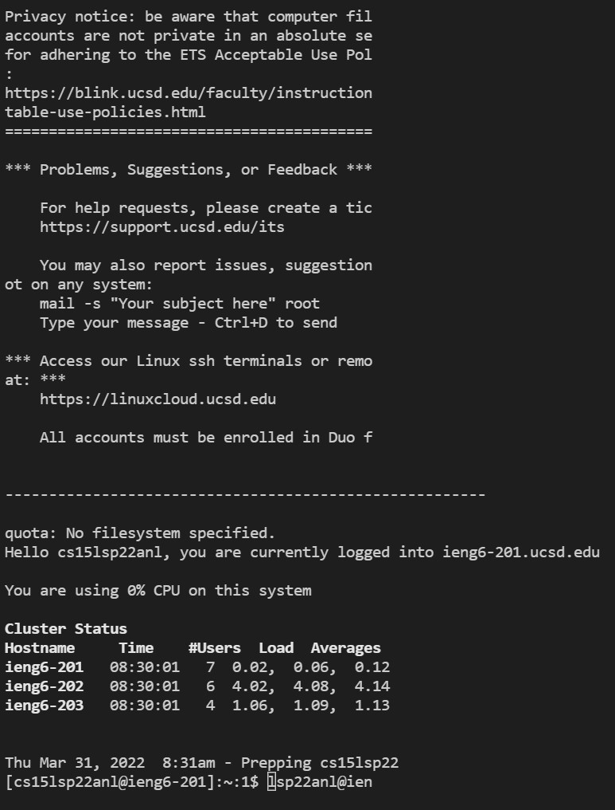
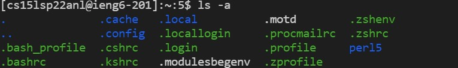
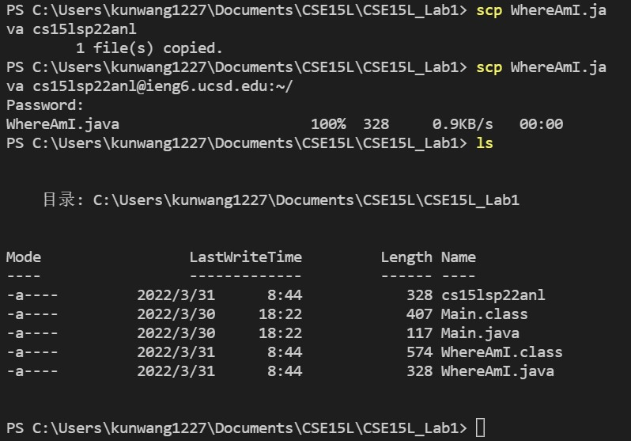
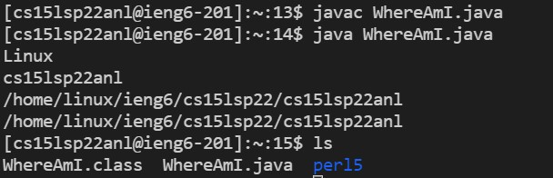
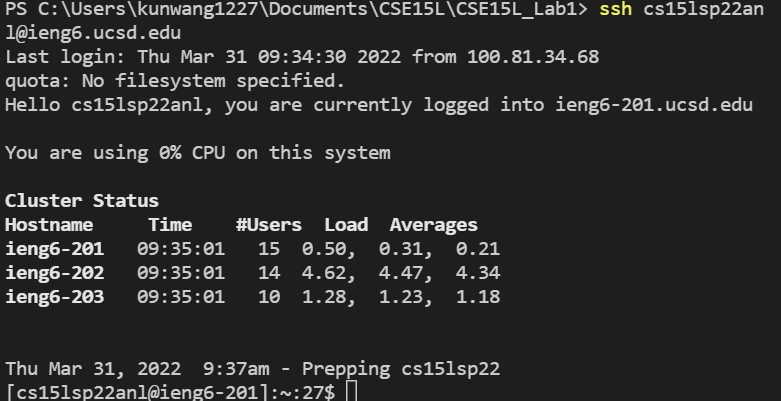
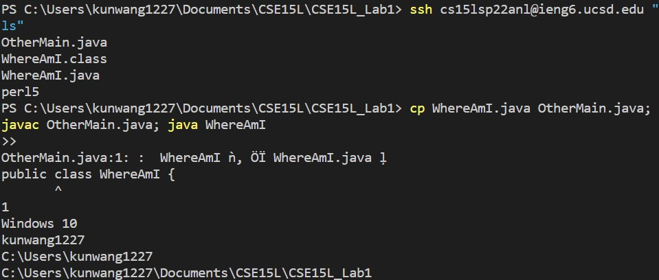

# This is Kun Wang CSE15L lab report week 2
Kun Wang\
Professor Soosai Raj\
07 April 2022

1. Installing VSCode:
- In this step I set-up VSCode and Java, which I have done for previous CS classes.\

2. Remotely connecting:
- In this step, I used my course specific username to remotely connect to @ieng6.ucsd.edu.
- Here is the input:
`ssh cse15lsp22anl@ieng6.ucsd.edu`
- I have to use the specific password set for the course accoount in order to connect.

3. Try some commands
- After connecting remotely, I have tried several command such as mkdir and ls.
- The following output is from command `ls -a`

4. Moving files with scp
- I was able to move the file WhereAmI.java with scp plus my course username and password.
- Here is the input: `scp cse15lsp22anl@ieng6.ucsd.edu`
- The output ran from the client returns my own username for the computer, the output ran from the server returns the course username.
"getProperty" in the code returns the property that is being specified by the string.

5. Setting an ssh key
- I have followed the instructions on setting up a ssh key throughout this step, including the extra steps for setting up key in Windows.
- After setting up the key, I was able to do ssh and scp with at least 30 seconds saved from typing the password
- Here is a screenshot of a run without password.

6. Optimizing remote running
- I was able to try out different combinations of optimizing inputs with semicolons and quotation marks.
- Here is a screeshot of some combinations

- The example in the picture shows how line 

`cp WhereAmI.java OtherMain.java; javac OtherMain.java; java WhereAmI` 
- can save plenty of time by using semicolon compare to typing and excecuting each command one at a time.
- The code above is able to compile `WhereAmI.java` and `OtherMain.java` and run both files in one line of code, which save around 3/4 of the time running each command individually(Self tested).
