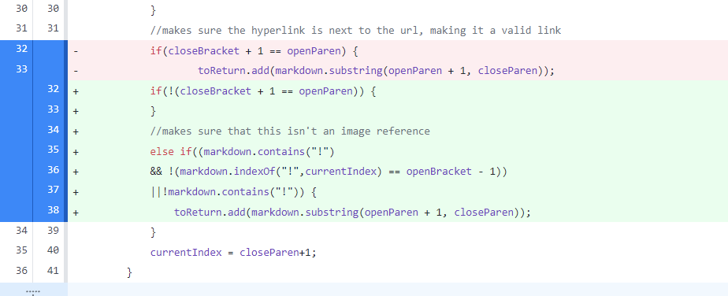
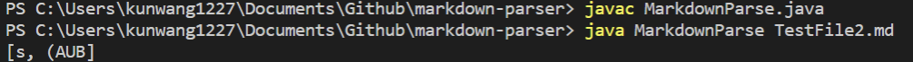
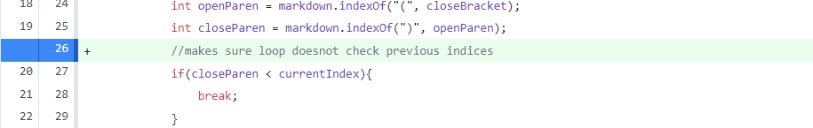
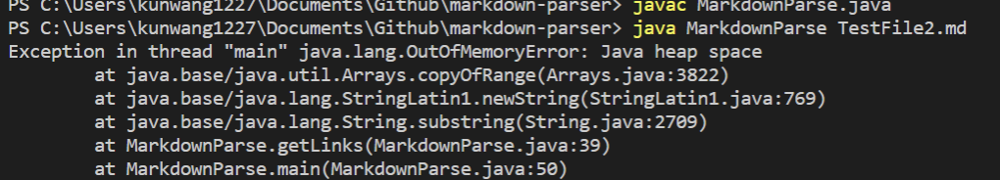
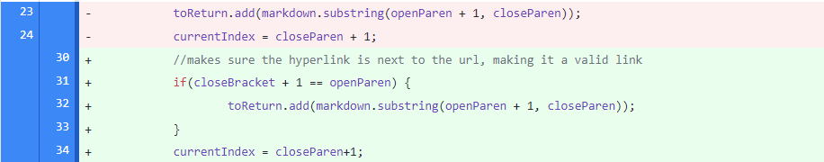
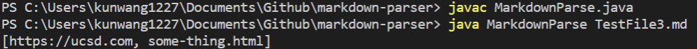

# This is Kun Wang CSE15L lab report 2

Kun Wang

Professor Soosai Raj

23 April 2022

Here are three changes:
1. Avoid images

- Link to the test file: [TestFile1](https://github.com/KunWang0129/markdown-parser/blob/main/TestFile1.md)
- Symptom of the input (This was file2 at the time): 

- The symptom of this bug is cause by the similar format of image and link of markdown. The imput induce this symptom by creating an image in the test file.
- For this particular bug, we avoid logging in image file names by checking `!` symbol in the file. Particulaly its position relative to the symbol `[`

2. Avoid checking previous indices(infinite loop)

- Link to the test file: [TestFile2](https://github.com/KunWang0129/markdown-parser/blob/main/TestFile2.md)
- Symptom of the input: 

- The symptom of this bug is cause by the empty spaces at the end of document. Because there is empty space at the end, the while loop will keep on searching for characters as index will never reach the end. The input induce the bug by adding a few empty spaces at the end of the file.
- For this bug, we check if `closeBracket` is less than current index to make sure loop isn't continued if it is checkng previous repeated indices. The loop will break as soom as the loop checks `closeBracket` of previous indices.

3. Checking correct link Markdown format

- Link to the test file: [TestFile3](https://github.com/KunWang0129/markdown-parser/blob/main/TestFile3.md)
- Symptom of the input:

- The symptom of this bug is cause by printing the link despite having incorrect format. For the form when `[]` and `()` have spaces in between, the link will stil be printed. The input induce the bug with space added between `]` and `(`
- For this bug, we check if the next index of `closeBracket` is `openParen`, which checks if there is spaces in between these symbols.

